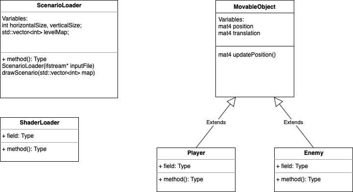

<h1>Assignment One</h1>

Run instructions:
1. Open the folder
2. Allow CMake to build everything
3. Set `main.cpp` as the startup item
4. Press run 

<h2>Description goes here</h2>

**UML Diagram**

Write description here

<h2>Clarifications</h2>
<ul>
<li>The maze/map can only be <strong>even</strong> numbers</li>

</ul>

